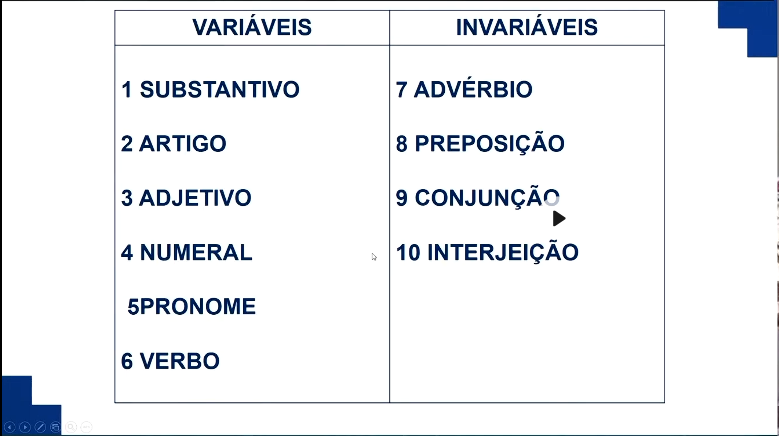
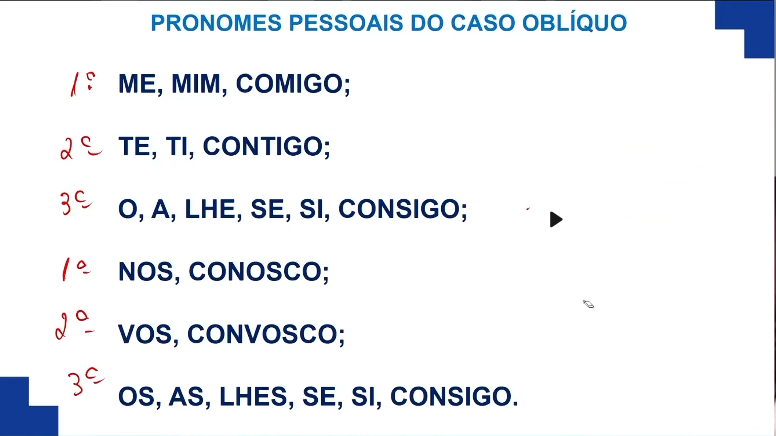

# As 10 Classes Gramaticais
    
## 6 Variáveis
  1. Substantivo
  2. Artigo
  3. Adjetivo
  4. Numeral
  5. Pronome
  6. Verbo

## 4 Invariáveis
  7. Advérbio
  8. Preposição
  9. Conjunção
  10. Interjeição
---

---
---
---

# Pronomes

## Pessoais do caso reto

###

## Pessoais do caso Oblíquo
### Singular 
  1. Me, Mim, Comigo
  2. Te, Ti, Contigo
  3. O, A, Lhe, Se, Si, Consigo
### Plural
  1. Nos, Convosco
  2. Vos, Convosco
  3. Os, As, Lhes, Se, Si, Consigo
---
  

---
---
---

